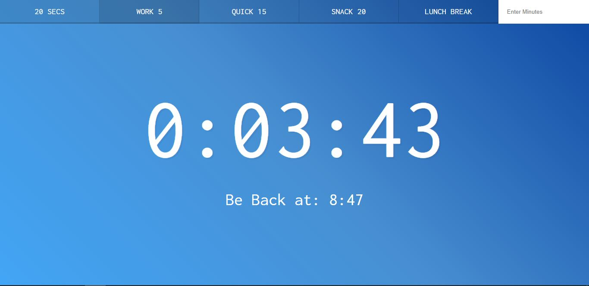

# CountdownTimer

This is project 29 in Wes Bos' JavaScript 30 course.  In this lesson, we built a count down timer with pre-programmed buttons for ease of use.  The project also allows the user to enter a custom count down and will tell you the time when you should be back.  As the tutorial finished displaying only minutes and seconds, I added the hour column to the project because I thought it was more user friendly.  If you're interested in doing it yourself, you can find the video <a href="https://www.youtube.com/watch?v=LAaf7-WuJJQ">here.</a>

